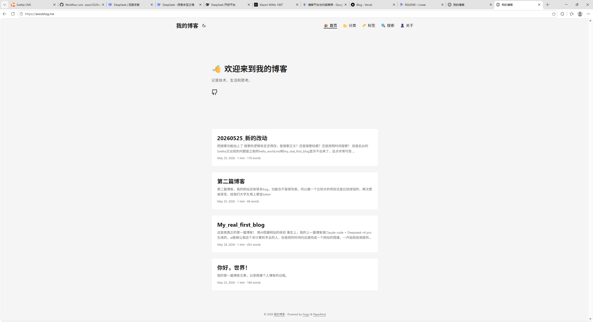
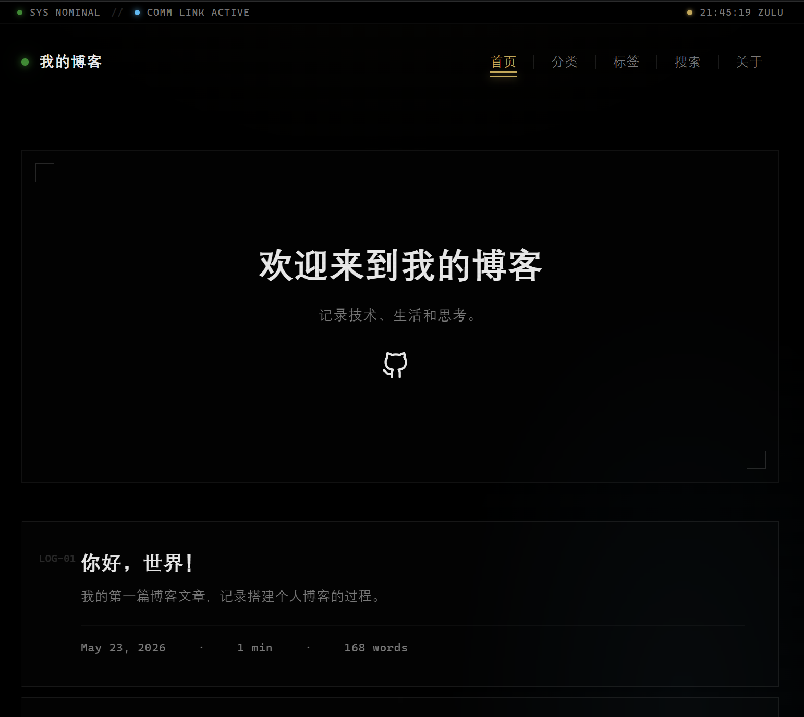
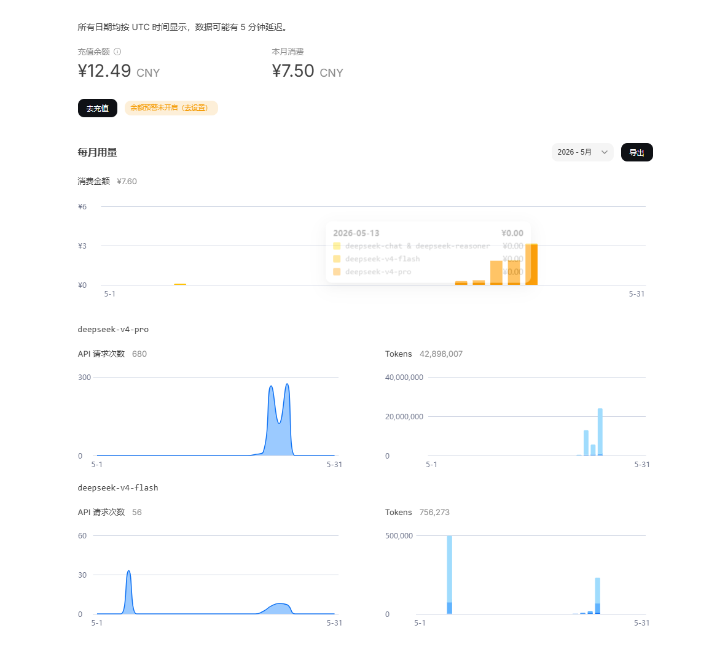

先来看看老样子

不得不说，面子在很多时候比里子更重要，原本的博客网站显得很廉价，现在确实是看起来高档了不少

在没有加入项目skill之前，它还创建了一版丑陋的UI，可惜我没有截图下来或者git push一版。大概描述一下吧，就是老样子的UI把色系改成了蓝粉色系，加上玻璃感，我说让他模仿科技大厂的UI，做的也是差强人意。最让我绷不住的是它做的一版极客UI，特别搞整个都变成屎绿色。

但是突然之间我醒悟了，skill的意义不就是这个吗？“AI不蠢只是你不会用”的含金量还在提高。这版UI我还是比较满意的，后续风格应该也不会大改

看看我还有哪些能增加的地方，静态部署web的终点又在哪里？

再次看看token用量，skill确实是花小钱办大事，这个token的消耗算正常吗？
